# オールドマン、序盤から猛攻！北本ヤングスを一蹴

令和7年9月28日、第37回北本市長杯ソフトボール大会シニアの部で行われた北本ヤングス対オールドマンの一戦は、オールドマンが初回から打線爆発。4番高城を中心に長短打を重ね、3回までに13得点を奪取。北本ヤングスを **13－2** のコールドで下した。

## 試合結果

| |1|2|3|計
|----|----|----|----|----
|北本ヤングス|0|0|2|2
|オールドマン|9|4|X|13X

## 試合総評

### 打線爆発と安定投球で理想的な勝利

オールドマンは初回から打線がつながり、一気に試合の主導権を握った。1番萩原司郎のバントヒットと果敢な走塁を皮切りに、2番萩原行雄も四球から盗塁・得点と続き、3番森永監督、4番高城、5番落合が揃って打点を挙げるなど、まさに切れ目のない攻撃を展開。さらに6番崎田が2安打2得点、7番加茂も長打と果敢な走塁で2得点を奪うなど、下位からも得点が重なった。8番谷口はタイムリーと犠牲フライで計2打点、9番早川もタイムリーを放ち、代打の筑までしっかり得点に絡むなど、出場全員が攻撃で貢献。**全員が得点圏を意識した「全員野球」** を体現した試合となった。

投げては岩田が3回を投げ抜き、与四球ゼロの安定した内容。被安打は4本ながら要所を締め、打線の大量援護に応える形で勝利投手となった。守備ではいくつかの細かいミスや課題も見えたが、大勢に影響はなく、むしろ最後まで積極的なプレーが目立った。

攻撃では9得点を奪った初回の集中力が光り、その後も着実に加点。序盤から圧倒し、最後まで主導権を渡さずに快勝を収めた。打線のつながりと走塁の積極性、投手の安定感がかみ合い、チームとして理想的な勝ち方を示した一戦だった。

「全員野球」を体現したオールドマンが、北本ヤングスを圧倒し、次戦へ大きな弾みをつけた。

## 見どころ

### 主砲高城、2安打2打点の大暴れ

4番・高城は初回に死球で出塁すると、相手のミスを突いて生還。続く第2打席では三遊間を破るタイムリー、第3打席でも内野安打で追加点を挙げ、 **2安打2打点の活躍**。守備でも一塁で安定感を見せ、チームを牽引した。

### 森永監督、バットでも采配でも魅せる

監督兼3番・森永は、初回に四球で出塁し、6番崎田のタイムリーで先制のホームを踏むと、第2打席、第3打席はいずれもクリーンヒット。第3打席ではレフト前に弾き返してタイムリーを放ち、 **2安打1打点** と打線の中軸として役割を果たした。

### 1、2番コンビがかき回す

1番・萩原司郎は俊足を飛ばし、バントヒットに四球で出塁、さらに盗塁とワイルドピッチでチャンスを拡大し、 **2得点1盗塁**。
2番・萩原行雄も四球から盗塁、そして得点と、上位打線が機能し序盤のビッグイニングを呼び込んだ。

### 下位打線からも得点続出

6番・崎田が2安打2得点1打点、7番・加茂が2出塁2得点、8番・谷口がヒット＆犠牲フライで2打点、9番・早川もタイムリー。さらに代打・筑もエラー出塁から盗塁、そして高城のタイムリーで生還と、 **全員が得点に絡む理想的な攻撃** を展開した。

### 岩田、安定の完投で勝利投手

マウンドを託された岩田は、3回を投げて被安打4・2失点ながら与四球ゼロ。要所を締め、打線の援護をしっかり勝利に結びつけた。球数もわずか45球と省エネ投法で、危なげなく試合を締めた。

# 打撃・守備成績

## オールドマン1番打者・萩原司郎

### 出塁と快足でリズムを作る

1番・萩原司郎は、攻撃の口火を切る役割をしっかり果たした。初回はショートゴロに倒れたものの、第2打席で見事にバントヒットを決めて出塁。持ち前の俊足を活かし、4番の適時打で先制のホームを踏んだ。さらに第3打席では四球で出ると、すかさず二盗を決め、相手バッテリーにプレッシャーを与える。ワイルドピッチの間に三塁へ進み、再び後続の打撃でホームへ帰還。結果として3打席で2得点、1安打1四球1盗塁と、数字以上に存在感のある働きを見せた。中堅守備では3つのフライを難なく処理し、安定感を示す。試合全体を通じ、出塁から走塁、そして堅実な守備でチームに流れを呼び込み、リードオフマンとしての役割を十二分に果たした。攻撃の起点として、今後も打線を勢いづける活躍が期待される。

* 打席数：3
* 打数：2
* 安打：1
* 塁打：1
* 得点：2
* 打点：0
* 盗塁：1
* 四死球：1（四球1）
* 補殺：0
* 刺殺：3
* エラー：0

## オールドマン2番打者・萩原行雄

### 四球と果敢な走塁で初回の猛攻を演出

2番・萩原行雄は、初回から役割を果たした。第1打席では冷静にボールを見極めて四球で出塁すると、すぐさま二盗を成功させ、相手バッテリーにプレッシャーをかける。その積極性が後続の適時打を呼び込み、先制攻撃の流れを作った。第2打席はピッチャーゴロに倒れたものの、果敢にスイングして攻撃姿勢を示した。その後は代打・筑に交代したが、守備ではリエントリーしてセカンドのポジションに復帰。二塁守備での落ち着いた動きは健在で、打撃成績以上に存在感を見せた。結果として1安打は出なかったが、**四球からの盗塁、そしてホームイン** という1番に続く攻撃のリズムを作り出した点は高く評価できる。得点機を確実に広げた萩原行雄の働きが、初回の大量得点につながったのは間違いないだろう。

* 打席数：2
* 打数：1
* 安打：0
* 塁打：0
* 得点：1
* 打点：0
* 盗塁：1
* 四死球：1（四球1）
* 補殺：0
* 刺殺：2
* エラー：0

## オールドマン3番打者・森永稔（監督・DP）

### 主砲として、そして采配者としてチームをけん引

3番・森永稔監督は、打席でも采配でも存在感を示した。初回は冷静に四球を選び、続く6番のタイムリーでチームの先制点を挙げる原動力となった。第2打席ではショート横を鋭く破る当たりでチャンスメーク。さらに第3打席では勝負強さを発揮し、レフト前にしぶとく運んでタイムリーを記録した。結果は2安打1四球1打点1得点と中軸打者らしい数字で、クリーンアップの役割をしっかり果たした。単なる結果だけでなく、初回の四球や状況に応じた打撃は、相手にとって脅威であり続けた。指揮官としても選手交代や走塁の判断で積極策を取り、序盤の猛攻を呼び込んだ。自らのバットでチームを鼓舞し、采配でも試合を掌握した森永監督。まさに「プレイングマネージャー」としてチームを引っ張る姿が光った一戦となった。

* 打席数：3
* 打数：2
* 安打：2
* 塁打：2
* 得点：1
* 打点：1
* 盗塁：0
* 四死球：1（四球1）
* 補殺：0
* 刺殺：0
* エラー：0

## オールドマン4番打者・高城勇二（一塁手）

### 勝負強さを発揮し、打線の核として存在感

4番・高城勇二は、この日も打線の中心として大きな役割を果たした。初回は死球で出塁すると、続く打者の安打と相手の悪送球を突いて生還。幸先よく得点に絡み、流れを呼び込んだ。第2打席では三遊間を鋭く抜けるタイムリーを放ち、さらに第3打席ではセカンドへの小飛球気味の当たりを全力で駆け抜けて内野安打とし、追加点を叩き出した。結果は2安打2打点1得点1死球と、まさにクリーンアップの仕事を全う。打席ごとに状況に応じた打撃を披露し、打線に厚みを与えた。また一塁守備でも安定感を見せ、3刺殺を記録。堅実な守備でチームに落ち着きをもたらした。勝負強さとチームの士気を高める働きを兼ね備えた高城の活躍は、この日の快勝劇を象徴するものだった。まさに「4番の仕事」を体現した一戦といえるだろう。

* 打席数：3
* 打数：2
* 安打：2
* 塁打：2
* 得点：1
* 打点：2
* 盗塁：0
* 四死球：1（死球1）
* 補殺：0
* 刺殺：3
* エラー：0

## オールドマン5番打者・落合恒夫（捕手）

### 初回に先制タイムリー、要所で存在感

5番・落合恒夫は、初回の好機でいきなり勝負強さを見せた。鋭い打球をサードに弾かせる強襲安打となり、先制点を叩き出すと同時に自らも出塁。その後、ライトのエラーに乗じてホームインし、攻撃の勢いを加速させた。第2打席はセカンドフライ、第3打席はファーストフライと凡退したが、初回の一打で十分にチームへ流れを呼び込んだといえる。最終的には1安打1打点1得点と、5番としての役割を最低限果たす結果となった。捕手としては相手打線を冷静にリードし、岩田投手を3回2失点でまとめ上げた点も見逃せない。大量リードの展開で気の緩みが出がちな場面でも堅実にゲームを運び、安定感を示した。打撃面では追加点につながる一打が欲しかったが、試合の立ち上がりで得点を呼び込んだ一振りの価値は大きい。攻守でチームを支えた一戦だった。

* 打席数：3
* 打数：3
* 安打：1
* 塁打：1
* 得点：1
* 打点：1
* 盗塁：0
* 四死球：0
* 補殺：0
* 刺殺：0
* エラー：0

## オールドマン6番打者・崎田恭助（遊撃手）

### 打撃好調、連続安打で攻撃をけん引

6番・崎田恭助は、この日も持ち味を存分に発揮した。初回の第1打席ではショート右を鋭く抜ける適時打を放ち、幸先よく打点をマーク。さらに後続のエラーを突いて自らもホームインし、流れを完全に引き寄せた。第2打席でもセカンド左を破るクリーンヒットを放ち、確実に出塁。続く8番の犠牲フライで帰還し、得点に貢献した。結果は2打数2安打2得点1打点と完璧な内容で、下位からの攻撃を勢いづける役割を担ったといえる。守備でも遊撃として堅実なプレーを見せ、2補殺を記録。要所で確実にアウトを重ね、投手を助けた。ただ、ショート後方へのフライ対応がやや遅れた場面や、外野からの送球で中継プレーが徹底されなかった点は惜しいところ。とはいえ大勢に影響はなく、攻守の安定感は十分に評価できる。攻撃でも守備でも存在感を放ち、チームの快勝劇に貢献した。

* 打席数：2
* 打数：2
* 安打：2
* 塁打：2
* 得点：2
* 打点：1
* 盗塁：0
* 四死球：0
* 補殺：2
* 刺殺：0
* エラー：0

## オールドマン7番打者・加茂政彦（三塁手・主将）

### 出塁から得点につなげ、攻撃の流れを演出

キャプテンの7番・加茂政彦は、攻撃面でしっかりと存在感を示した。第1打席ではライトのエラーを誘って一気に三塁へ進み、続く8番の適時打でホームに生還。相手守備の隙を見逃さず得点につなげた判断はさすが主将。第2打席ではライト前への弱い打球ながら、俊足を活かして二塁打に。さらに9番のレフトフライで相手送球が乱れる間に果敢に本塁を陥れ、再び得点を記録した。結果は2打数1安打2得点と効率の良い働きで、下位打線からも得点を重ねる原動力となった。守備面ではサードとして1補殺を記録し、堅実なプレーを見せたほか、三塁側ネット際のファールフライを惜しくも取り損ねた場面では、最後までボールを追いかけるガッツあふれる姿勢が光った。自らの打撃で出塁し、足で進塁し、最後はホームに帰ってくる――加茂らしい粘り強いプレーが攻撃の流れをつくった。主将として攻守で貢献度の高い一戦となった。

* 打席数：2
* 打数：2
* 安打：1
* 塁打：2
* 得点：2
* 打点：0
* 盗塁：0
* 四死球：0
* 補殺：1
* 刺殺：0
* エラー：0

## オールドマン8番打者・谷口文彦（左翼手）

### 勝負強さとつなぎの意識で確実に得点

8番・谷口文彦は、打撃でしっかり結果を残し、勝負強さを発揮した。初回の第1打席では、鋭い当たりをセカンドの横へ弾き返し、適時打で打点をマーク。さらに二盗を決めてチャンスを広げ、9番の安打で本塁へ生還した。続く第2打席では、ランナー三塁の好機でセンターへ大きな犠牲フライ。自らはアウトになりながらも確実に走者を返し、追加点を奪った。結果は1安打2打点1得点1盗塁に犠牲フライと、下位打線ながら得点に直結する働きを見せた点は大きい。守備でもレフトで1刺殺を記録し、堅実に役割を果たした。派手さはないが、チームに必要な場面でしっかり仕事をする姿勢は、下位打線における理想的な打者像といえるだろう。攻守にわたり確実なプレーを積み重ね、チームの大量得点を支える重要なピースとなった。

* 打席数：2
* 打数：1
* 安打：1
* 塁打：1
* 得点：1
* 打点：2
* 盗塁：1
* 四死球：0
* 補殺：0
* 刺殺：1
* エラー：0

## オールドマン9番打者・早川孝一（右翼手）

### タイムリーで打点を記録、下位から攻撃をつなぐ

9番・早川孝一は、初回の第1打席でセカンド横を抜けるタイムリーを放ち、下位からの得点を呼び込んだ。続く3番・森永の安打で自らも生還し、序盤の猛攻にしっかり絡んだのは大きな収穫だった。第2打席はレフトフライに倒れたものの、**1安打1打点1得点** と十分にチームに貢献。守備ではライトでのプレー中に前方への飛球処理をもたつき、打者走者を二塁へ進めてしまう場面があったのは惜しまれる。ただ、大勢に影響はなく、攻撃での働きが光った一戦となった。打順のめぐりから多くの打席は回らなかったが、少ないチャンスを確実に結果につなげた点は評価に値する。攻撃の厚みを増す一打でチームの大量得点を後押しし、下位打線の存在感を示した。

* 打席数：2
* 打数：2
* 安打：1
* 塁打：1
* 得点：1
* 打点：1
* 盗塁：0
* 四死球：0
* 補殺：0
* 刺殺：0
* エラー：1

## オールドマン代打・筑

### エラー出塁から積極走塁で得点を演出

代打で登場した筑は、限られた打席で持ち味を存分に発揮した。第1打席ではサードゴロを相手が処理しきれずエラー出塁。これを見逃さず、一気に勝負を仕掛けるように三塁まで盗塁を決め、積極的な走塁でチャンスを拡大した。続く4番・高城のタイムリーで本塁に生還し、代打として最高の結果を残したといえる。打撃面で安打こそ記録されなかったが、**出塁・盗塁・得点** と一連のプレーで得点に直結する動きを見せた点は高く評価できる。短い出場時間ながらも、相手守備に揺さぶりをかける姿勢はチームに勢いを与えた。再び守備に戻る萩原行雄をつなぐ“つなぎ役”としても十分な働きであり、代打起用に応える内容だった。与えられた場面で役割を全うし、攻撃の厚みを加えた筑のプレーは、この試合の勝因のひとつといえるだろう。

* 打席数：1
* 打数：0
* 安打：0
* 塁打：0
* 得点：1
* 打点：0
* 盗塁：1
* 四死球：0
* 補殺：0
* 刺殺：0
* エラー：0

## オールドマン投手・岩田康男（FP）

### 省エネ投球で試合を掌握、安定感抜群のマウンドさばき

先発を任された岩田康男は、3回を投げ切り勝利投手となった。打者14人に対しわずか45球でまとめる省エネ投球を披露。被安打4、与四球0、与死球1と走者を背負う場面はあったものの、大きく崩れることはなく、要所をしっかり締めて最少失点に抑えた。2失点はあったが、いずれも序盤の大量リードという展開で気負わず投げ切り、試合をコントロールするベテランらしい落ち着きが光った。特に四球を一つも与えなかった点はリズムを乱さず、守備陣も集中力を保てた大きな要因といえる。打線の爆発で大量援護をもらいながらも、決して気を抜かず淡々とアウトを重ねていく姿は、チームに安心感を与えた。派手な奪三振こそなかったが、堅実な投球で試合を作るという先発の役割を完遂。勝利投手として、安定したマウンドさばきが光った一戦だった。

* 投球回数：3
* 打者数：14
* 被安打：4
* 失点：2
* 自責点：2
* 与四球：0
* 与死球：1
* 投球数：45
* 勝敗：勝利投手

## アルバム
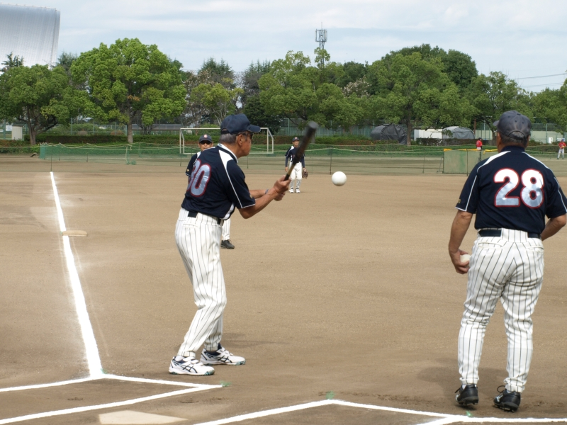
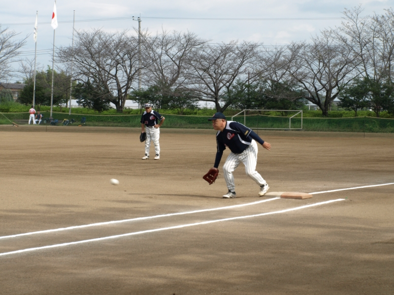
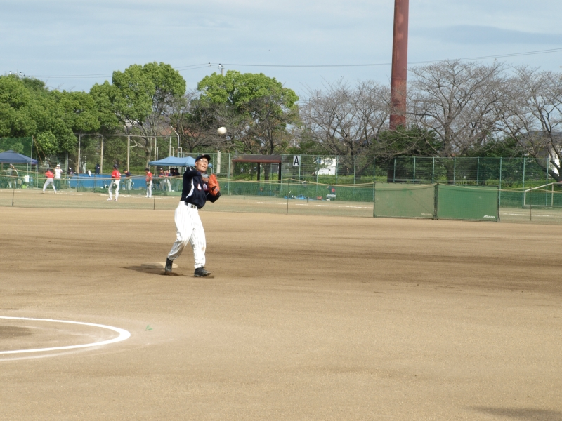
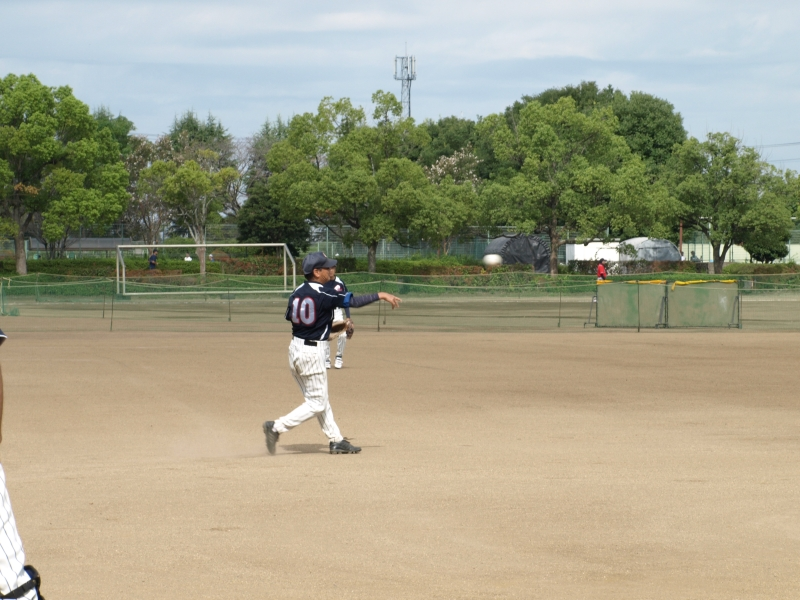
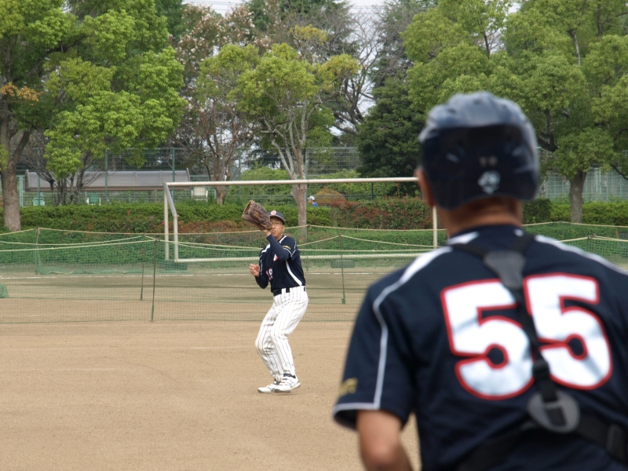
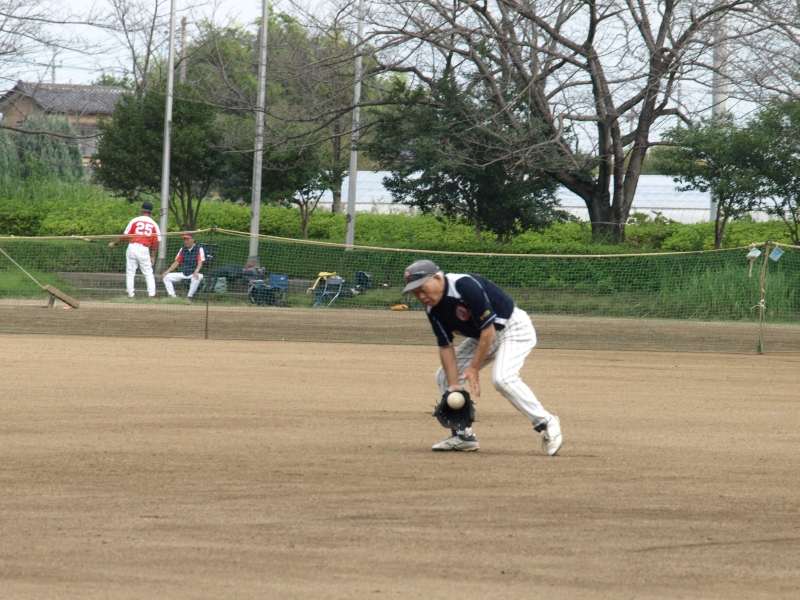
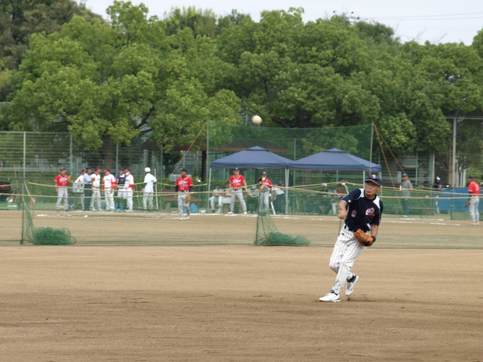
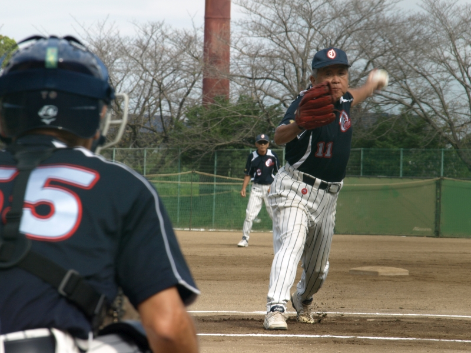
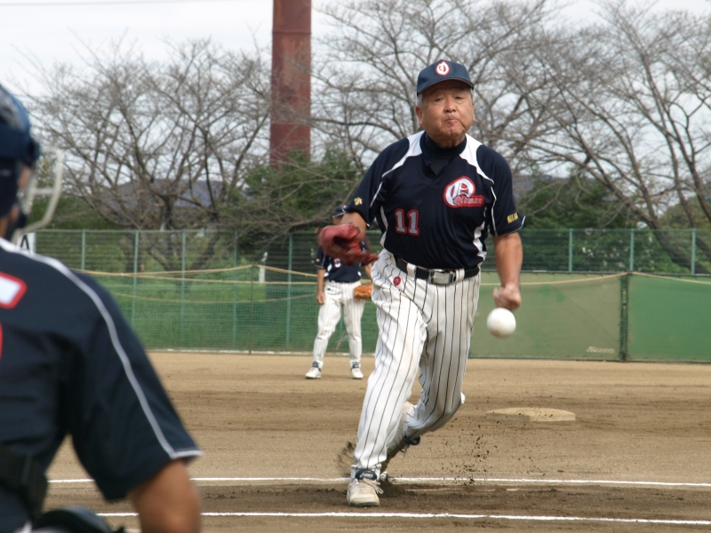
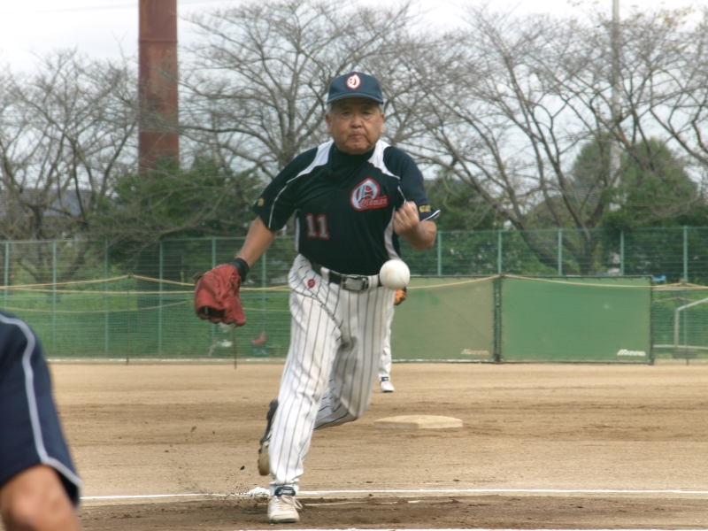
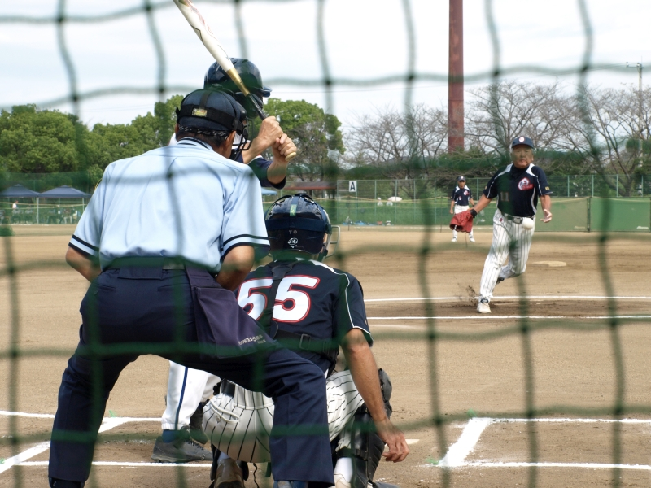
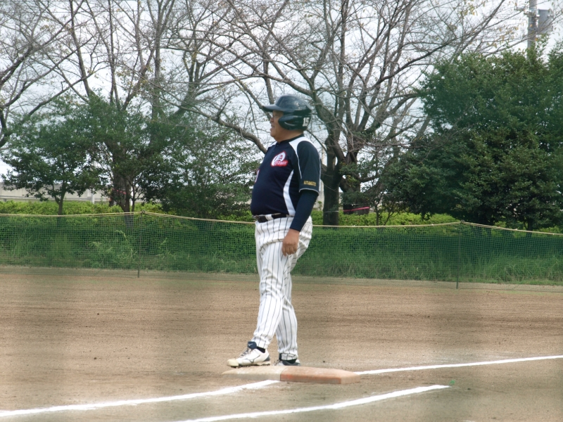
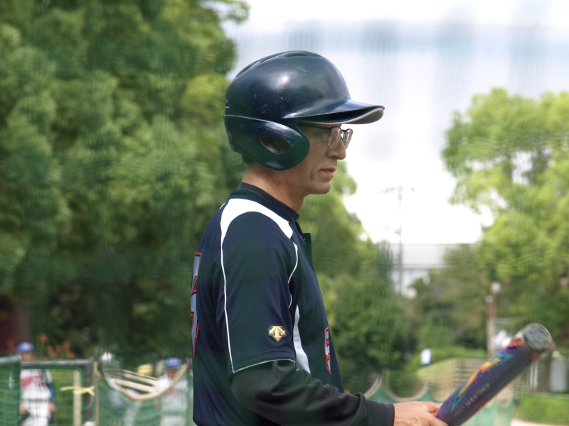
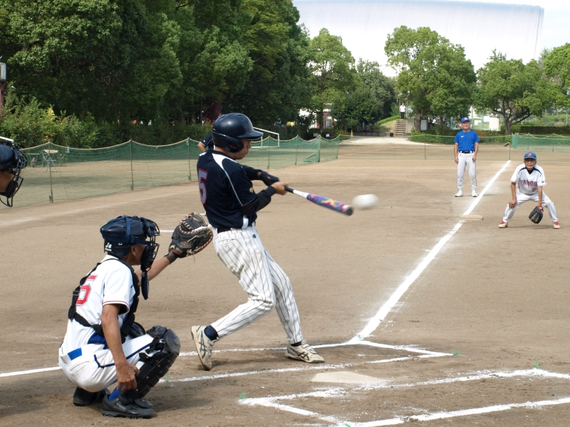
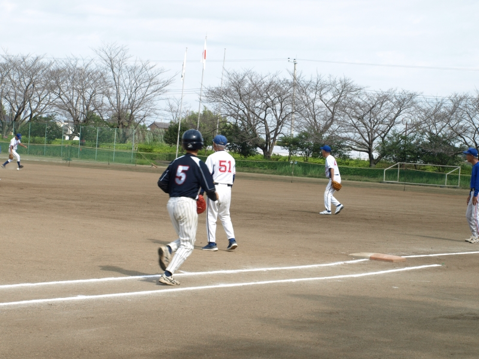
